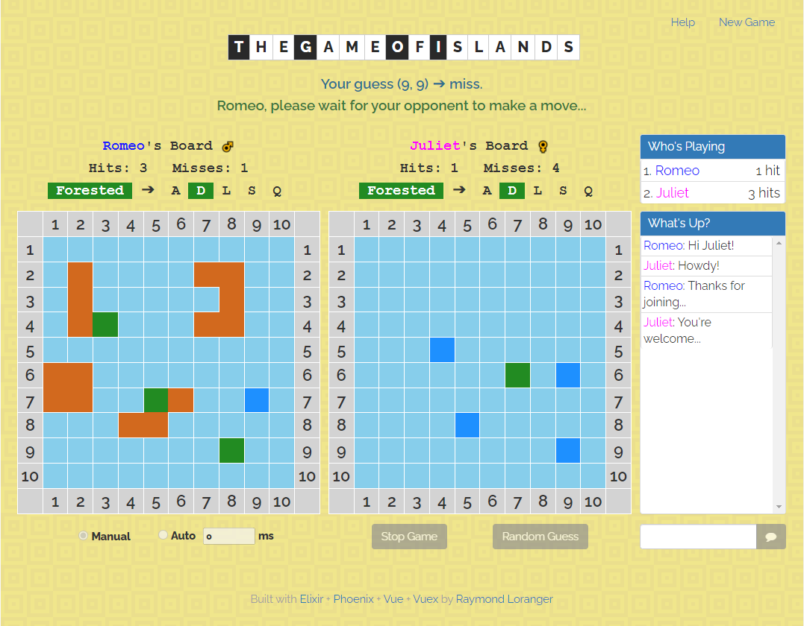

# Islands Vue Client

Web interface for the _Game of Islands_
featuring **_Vue Components_** and **_Vuex_**.

It’s a game for two players, and each player has a board, which consists of a
grid of one hundred squares. The grid is labeled with the numbers 1 through
10 across the top for the columns and down the left side for the rows.
Each square is named by its coordinates of the form (row, column).

The players cannot see each other’s boards.

The players have matching sets of islands of various shapes and sizes, which
they place on their own boards.

|Island                         |Symbol|Squares|Shape              |
|-------------------------------|:----:|:-----:|:-----------------:|
|&nbsp;&nbsp;&nbsp;&nbsp;Atoll  |  A   |   5   |![atoll][atoll]    |
|&nbsp;&nbsp;&nbsp;&nbsp;S-Shape|  S   |   4   |![s-shape][s-shape]|
|&nbsp;&nbsp;&nbsp;&nbsp;L-Shape|  L   |   4   |![l-shape][l-shape]|
|&nbsp;&nbsp;&nbsp;&nbsp;Square |  Q   |   4   |![square][square]  |
|&nbsp;&nbsp;&nbsp;&nbsp;Dot    |  D   |   1   |![dot][dot]        |

The players can move the islands around as much as they like until they say
that they are set. After that, the islands must stay where they are for the
rest of the game.

Once both players have set their islands, they take turns guessing squares
on their opponent’s board, trying to find the islands. For every correct guess,
we plant a palm tree on the island at that square. When all the squares
of an island have palm trees, the island is forested.

The first player to forest all of her opponent’s islands is the winner.

##### Inspired by the book [Functional Web Development](https://pragprog.com/book/lhelph/functional-web-development-with-elixir-otp-and-phoenix) by Lance Halvorsen.

##### Also inspired by the course [Multi-Player Bingo](https://pragmaticstudio.com/courses/unpacked-bingo) by Mike and Nicole Clark.

## 

## Play the _Game of Islands_ online

You can play the _Game of Islands_ by visiting either of these 2 sites:

* [Islands on Gigalixir][Islands on Gigalixir]
* [Islands on Render][Islands on Render] (may be suspended)

You then hit `New Game` from one session and `Join` from another.
You position your islands by dragging them or hitting `Random Positions`.
Finally you hit `Set Islands` and take turns guessing squares on your
opponent's board. You can also let the engine play for you by hitting `Auto`.

## Play the _Game of Islands_ locally

To run `islands_vue_client` locally, first clone it from GitHub:

* git clone https://github.com/RaymondLoranger/islands_vue_client

Then run these commands to start your Phoenix server:

* Change directory with `cd islands_vue_client`
* Install dependencies with `mix deps.get`
* Install Node.js dependencies with `cd assets`, `npm install` and `cd ..`
* Start Phoenix endpoint with `mix phx.server`

Now you can visit [`localhost:4000`](http://localhost:4000) from your browser.

## Versions/Releases used

- Phoenix v1.5.7
- Erlang/OTP 22
- Elixir 1.11.3
- Node v14.15.4
- Vue.js v2.6.12
- Vuex v3.6.2

[atoll]: assets/static/images/atoll.png
[s-shape]: assets/static/images/s-shape.png
[l-shape]: assets/static/images/l-shape.png
[square]: assets/static/images/square.png
[dot]: assets/static/images/dot.png

[Islands on Gigalixir]: https://unused-stained-newtnutria.gigalixirapp.com/
[Islands on Render]: https://islands-0kdm.onrender.com/
