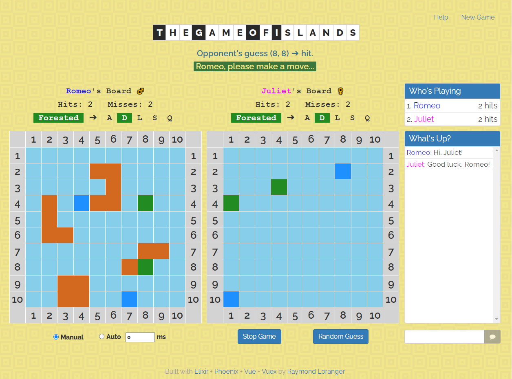

# Islands Vue Client

Web interface for the _Game of Islands_
featuring **_Vue Components_** and **_Vuex_**.

It’s a game for two players, and each player has a board, which consists of a
grid of one hundred squares. The grid is labeled with the numbers 1 through
10 across the top for the columns and down the left side for the rows.
Each square is named by its coordinates of the form (row, column).

The players cannot see each other’s boards.

The players have matching sets of islands of various shapes and sizes, which
they place on their own boards.

|Island  |Squares|
|--------|:-----:|
| Atoll  |  5    |
| S-Shape|  4    |
| L-Shape|  4    |
| Square |  4    |
| Dot    |  1    |

The players can move the islands around as much as they like until they say
that they are set. After that, the islands must stay where they are for the
rest of the game.

Once both players have set their islands, they take turns guessing squares
on their opponent’s board, trying to find the islands. For every correct guess,
we plant a palm tree on the island at that square. When all the squares
of an island have palm trees, the island is forested.

The first player to forest all of her opponent’s islands is the winner.

##### Based on the book [Functional Web Development](https://pragprog.com/book/lhelph/functional-web-development-with-elixir-otp-and-phoenix) by Lance Halvorsen.

## 

To start your Phoenix server:

  * Install dependencies with `mix deps.get`
  * Install Node.js dependencies with `npm install` inside the `assets` directory
  * Start Phoenix endpoint with `mix phx.server`

Now you can visit [`localhost:4000`](http://localhost:4000) from your browser.

Ready to run in production? Please [check our deployment guides](https://hexdocs.pm/phoenix/deployment.html).

## Learn more

  * Official website: https://www.phoenixframework.org/
  * Guides: https://hexdocs.pm/phoenix/overview.html
  * Docs: https://hexdocs.pm/phoenix
  * Forum: https://elixirforum.com/c/phoenix-forum
  * Source: https://github.com/phoenixframework/phoenix
